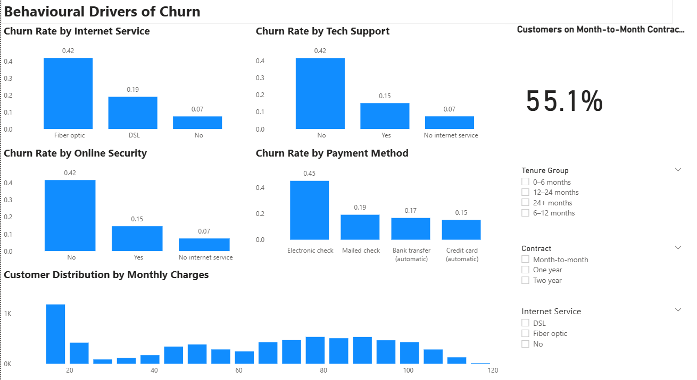
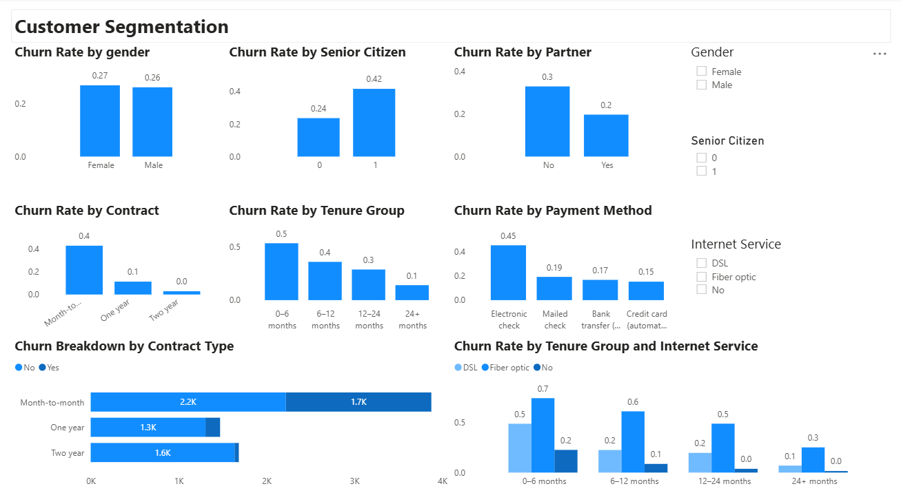

# telco-churn-powerbi-dashboard
Power BI dashboard analysing telco customer churn, behavioural drivers, and segmentation.

📊 Telco Customer Churn Dashboard
A Power BI project analysing customer churn patterns, behavioural drivers, and high‑risk customer segments to support data‑driven retention strategies.

🎯 Project Overview
This project explores customer churn within a telecommunications company using a structured, multi‑page Power BI dashboard. The goal is to understand:
- What the churn situation looks like
- Why customers are leaving
- Who is most at risk
The dashboard is designed to mirror real business reporting: clean layout, consistent formatting, and a clear analytical narrative.

🧠 Business Problem
Customer churn directly impacts revenue and long‑term growth. The company needs to:
- Identify the main drivers of churn

- Understand which customer groups are most vulnerable
- Prioritise retention strategies based on data
- Monitor churn KPIs over time
This dashboard provides a foundation for targeted, evidence‑based decision‑making.

🛠️ Tools & Skills Demonstrated
- Power BI — data modelling, DAX measures, interactive visuals, slicer panels
- DAX — churn rate calculations, KPIs, segmentation metrics
- Data Cleaning — handling missing values, creating tenure groups, formatting fields
- Visual Design — consistent layout, minimalistic theme, professional spacing
- Analytical Thinking — behavioural analysis, segmentation logic, KPI selection
- Storytelling — structuring insights across three pages for clarity and impact

📁 Dataset
The dataset contains customer demographics, contract details, service usage, and churn status. Key fields include:
- Customer demographics (gender, senior citizen, partner, dependents)
- Account information (contract type, payment method, tenure)
- Services (internet, phone, streaming)
- Churn flag (Yes/No)

📄 Dashboard Structure
The report is organised into three pages, each answering a different business question.
1. Overview — What is happening?
- Total customers
- Overall churn rate
- Monthly churn trend
- High‑level churn breakdowns
- KPI cards for quick insight
This page sets the context and highlights the scale of the churn problem.

2. Behavioural Drivers — Why is it happening?
- Churn by contract type
- Churn by tenure group
- Churn by tenure group
- Churn by payment method
- Churn by internet service
- A behavioural KPI (e.g., % Month‑to‑Month customers)
- Right‑side slicer panel
This page uncovers behavioural patterns that strongly influence churn.

3. Customer Segmentation — Who is churning?
- Demographic segmentation (gender, senior citizen, partner)
- Structural segmentation (contract, tenure group, payment method)
- Combined visuals (Contract × Churn, TenureGroup × InternetService)
- Slicer panel for interactive filtering
This page identifies high‑risk customer groups and supports targeted retention strategies.

🔍 Key Insights
- Month‑to‑Month customers churn significantly more than those on longer contracts.
- New customers (0–12 months) are the most likely to churn.
- Electronic Check users show the highest churn among payment methods.
- Senior Citizens and customers without a partner have higher churn rates.
- Fiber Optic customers churn more in early tenure stages compared to DSL users.
These insights point to clear opportunities for retention campaigns.

📈 KPIs
- Overall Churn Rate
- Monthly Churn Trend
- % of Month‑to‑Month Customers
- % of High‑Risk Segments (depending on slicer selections)
KPIs are designed to be simple, clean, and consistent across pages.

🧩 Data Modelling & DAX
Key measures include:

Churn Rate =
DIVIDE(
    CALCULATE(COUNTROWS('clean_telco_churn'), 'clean_telco_churn'[Churn] = "Yes"),
    [Total Customers]
)

Total Customers =
COUNTROWS('clean_telco_churn')

Additional measures support segmentation, KPIs, and visual interactions.

## 🖼️ Screenshots

**Overview Page**  

**Behavioural Drivers Page**  

**Customer Segmentation Page**  

📦 Project Files
- Telco_Churn_Dashboard.pbix
- clean_telco_churn.csv
- README (this file)

🚀 What I Learned
- How to design a multi‑page dashboard with consistent visual language
- How to structure a business narrative across pages
- How to use DAX to build KPIs and segmentation metrics
- How to balance minimalism with analytical depth
- How to create a recruiter‑ready portfolio project

📬 Contact
If you’d like to discuss this project or my portfolio work:
Joana — Data Analyst (London, UK)
LinkedIn: linkedin.com/in/o-joana-oseghwa
GitHub: github.com/oseghwajoana-cmd

